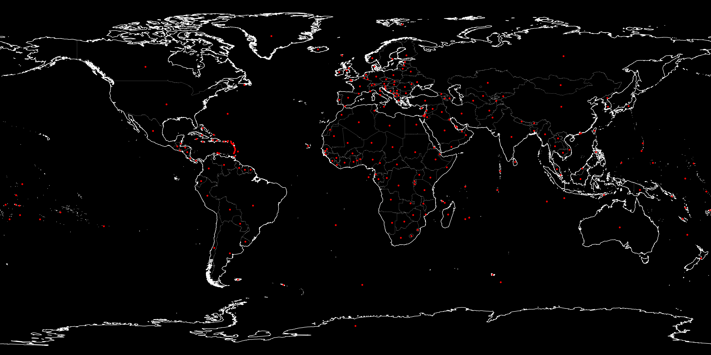
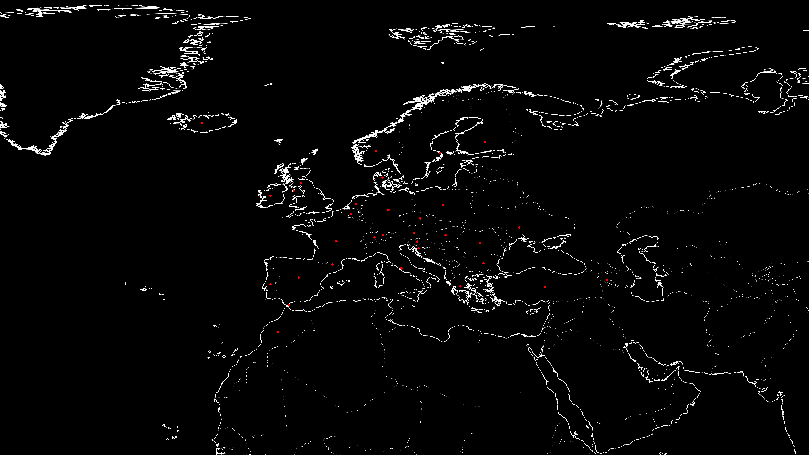

# :world_map:  mapper
Plot all your photos on a map using cartopy

# Usage
How to generate the map
```
python mapper.py [DIR]
```

# Examples
An example with the coordinates of all the capitals


An example with some random coordinates


